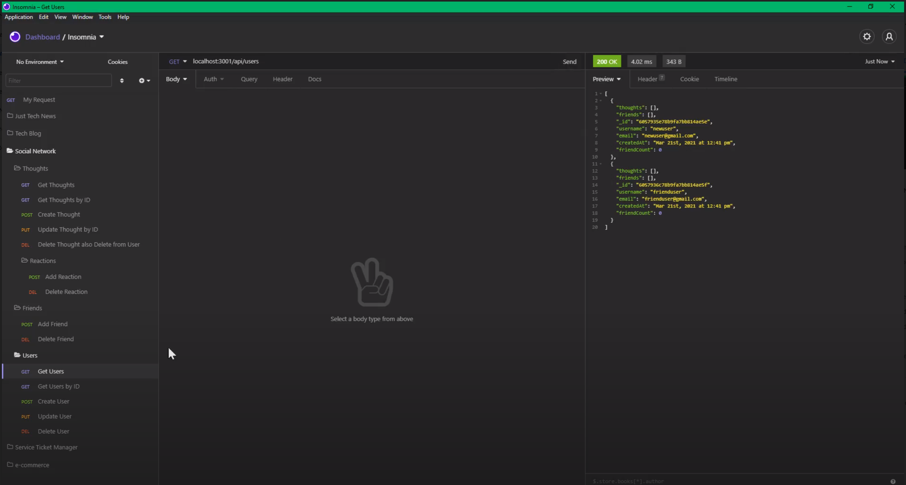
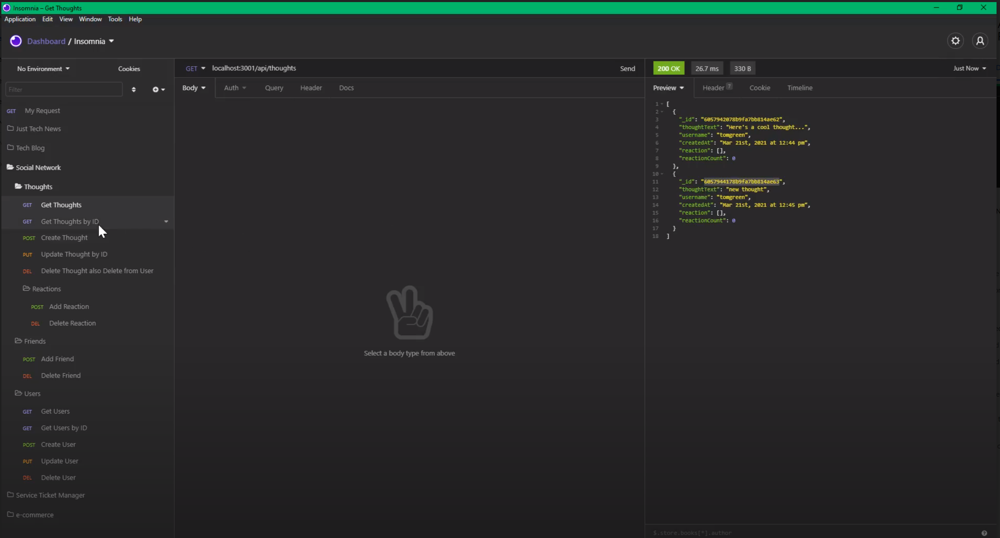

<h1 align="center">
Social Network
</h1>

## Table of Contents
- [Description](#description)
- [User Story](#user-story)
- [Acceptance Criteria](#Acceptance-criteria)
- [Screenshots](#screenshots)
- [Installation](#installation)
- [License](#license)
- [Language](#language)
- [Contributors](#contributors)
- [Questions](#questions)

## Description
This is an API app for Social Networking.  There is only a backend app.

## User Story
```
AS A social media startup
I WANT an API for my social network that uses a NoSQL database
SO THAT my website can handle large amounts of unstructured data
```

## Acceptance Criteria
```
GIVEN a social network API
WHEN I enter the command to invoke the application
THEN my server is started and the Mongoose models are synced to the MongoDB database
WHEN I open API GET routes in Insomnia Core for users and thoughts
THEN the data for each of these routes is displayed in a formatted JSON
WHEN I test API POST, PUT, and DELETE routes in Insomnia Core
THEN I am able to successfully create, update, and delete users and thoughts in my database
WHEN I test API POST and DELETE routes in Insomnia Core
THEN I am able to successfully create and delete reactions to thoughts and add and remove friends to a user’s friend list
```

## Screenschots
Add User and Friend
[](https://drive.google.com/file/d/1smlw0QgJOEJyiv-LQLLHKKh9WdCFQhXv/view?usp=sharing)
Add Thoughts and Reactions
[](https://drive.google.com/file/d/17e15Cdi3bIjZ7TFvj7FFn1NpzsMcjHsT/view?usp=sharing)
## Installation
Install npm with npm install or npm i to install node.js<br />
Start the server with npm start

## License
<br />
This application is covered by the MIT license. 

## Language


## Contributors
Matt Damron

## Questions
- Find me on GitHub: [Matt Damron](https://github.com/matthewdamron)<br />
- Email me [Matt Damron](mailto:mattdamron@msn.com)
